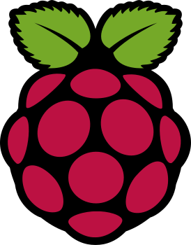

# Blockvase

## Full Bitcoin Knots Node, DATUM Gateway & ASIC Miner

### The product

The following describes the **pre-assembled, chain-synced Blockvase** sold at [blockvase.com](https://blockvase.com):

Blockvase is an all-in-one device for the sovereign bitcoiner. It gives you a full Bitcoin Knots node with true solo mining, enabled by a local DATUM gateway and a built-in BM1366 Bitcoin mining ASIC chip all within one visually stunning, petite, white and copper cube.

Solo mining is **DATUM + your local Knots node**, not a public mining pool. Block templates come from Knots via DATUM Gateway. The PiAxe software still speaks **Stratum v1**, but only to the local gateway on `127.0.0.1:23334`—that is the miner↔gateway wire protocol, not pool Stratum mining.

A smooth glass-covered display shows current sync status during initial block download, then becomes a live Bitcoin mempool animation of every transaction waiting to be confirmed. The device also locally hosts a web dashboard at [blockvase.local](http://blockvase.local) so you can use your own node to view Bitcoin network metrics and transactions. Future updates will unlock even more functionality.

Setup is quick and easy. Just plug in the device, press the button on the back inside the vent hole, and scan the QR code to begin. You'll be connected to the device's onboard access point and scan one more QR code to connect the device to your network via 2.4GHz WiFi for maximum range.

### This repository

We have **open-sourced the entire Blockvase stack**—software and hardware—so anyone can build their own, inspect every layer, and verify that what runs on the device matches what is published here. Portal, kiosk, Bitcoin Knots install, DATUM Gateway, PiAxe-miner, device scripts, and the modified PiAxe HAT design (`hardware/piaxe/`) all live in this repo. Prefer a finished unit? Get one at [blockvase.com](https://blockvase.com).

| | |
|---|---|
| **OS** | [Raspberry Pi OS 64-bit](https://www.raspberrypi.com/software/) (Bookworm or later), Desktop or Lite |
| **Login user** | Must be named **`blockvase`** |
| **Display** | Full-screen kiosk (not the Pi desktop) |
| **Networking** | NetworkManager |
| **Node** | [Bitcoin Knots](https://github.com/bitcoinknots/bitcoin/releases/tag/v29.3.knots20260508) (full archival, local RPC only) |
| **Mining** | Local [DATUM Gateway](https://github.com/OCEAN-xyz/datum_gateway) (solo from Knots GBT) + BM1366 (PiAxe); Stratum v1 only to localhost |
| **Buy** | Pre-assembled & synced: [blockvase.com](https://blockvase.com) |

---

## Credits

Blockvase stands on open-source Bitcoin, mining, and Raspberry Pi work. Logos below are for attribution only; trademarks belong to their owners.

<p align="center">
  <a href="https://www.raspberrypi.com/"></a>
  &nbsp;&nbsp;&nbsp;&nbsp;
  <a href="https://bitcoin.org/"></a>
  &nbsp;&nbsp;&nbsp;&nbsp;
  <a href="https://bitcoinknots.org/"></a>
</p>
<p align="center">
  <a href="https://ocean.xyz/"></a>
  &nbsp;&nbsp;&nbsp;&nbsp;
  <a href="https://github.com/OCEAN-xyz/datum_gateway"></a>
  &nbsp;&nbsp;&nbsp;&nbsp;
  <a href="https://osmu.wiki/"></a>
  &nbsp;&nbsp;&nbsp;&nbsp;
  <a href="https://d-central.tech/"></a>
</p>

### Bitcoin Knots

<p>
  <a href="https://bitcoinknots.org/">
    
  </a>
</p>

| | |
|---|---|
| **Project** | [Bitcoin Knots](https://bitcoinknots.org/) ([github.com/bitcoinknots/bitcoin](https://github.com/bitcoinknots/bitcoin)) |
| **License** | MIT (see upstream `COPYING`) |
| **Role in Blockvase** | Local full archival node and JSON-RPC (`bitcoind`). Portal metrics, mempool display, and DATUM GBT all talk to this node on `127.0.0.1`. |

**How we use it**

- Installed from official Knots release tarballs by `scripts/install-bitcoin-knots.sh` during bootstrap (not vendored as source in this repo).
- Systemd unit: `systemd/bitcoind.service`.
- RPC credentials live in `/etc/bitcoin/bitcoin.conf` and are mirrored into the portal config for localhost-only use.

**Blockvase modifications**

- None to the Knots binary or upstream source.
- Packaging and ops only: install script, systemd unit, chain-guard / reindex helpers, and portal RPC wiring.

### DATUM Gateway (OCEAN)

<p>
  <a href="https://ocean.xyz/">
    
  </a>
  &nbsp;&nbsp;
  <a href="https://ocean.xyz/">
    
  </a>
  &nbsp;&nbsp;
  <a href="https://github.com/OCEAN-xyz/datum_gateway">
    
  </a>
</p>

| | |
|---|---|
| **Project** | [DATUM Gateway](https://github.com/OCEAN-xyz/datum_gateway) by [OCEAN](https://ocean.xyz/) (Bitcoin Ocean, LLC, Jason Hughes, and contributors) |
| **License** | MIT (see `datum_gateway/LICENSE`). The DATUM / OCEAN trademarks are **not** licensed by that file; used here for credit only. |
| **Role in Blockvase** | Solo mining gateway: pulls block templates from local Knots (GBT/RPC) and serves work to the ASIC client. Not connected to a remote DATUM pool (`pool_host` empty, `pooled_mining_only` false). |

**How we use it**

- Source is vendored under `datum_gateway/` and built on-device by `scripts/install-mining-stack.sh`.
- Runtime config: `/etc/blockvase/datum_gateway_config.json` (written by `scripts/set-mining-payout.sh`).
- Systemd unit: `systemd/datum-gateway.service`.
- Exposes **Stratum v1 on localhost only** (`127.0.0.1:23334`) so PiAxe-miner can consume work. That Stratum endpoint is the local hardware interface; work origin is DATUM + Knots, not a public Stratum pool.

**Blockvase modifications**

- No functional forks of the DATUM C sources for product features.
- Integration layer only:
  - Build/install path and systemd unit templating
  - Generated solo-mining JSON config (RPC user/password from Knots, payout address, local Stratum bind; no remote pool)
  - DATUM stays disabled until a payout address is saved (DATUM requires a valid `mining.pool_address`)
  - Coinbase tags set to Blockvase / DATUM solo in generated config

### PiAxe-miner (and PyMiner)

<p>
  <a href="https://osmu.wiki/">
    
  </a>
  &nbsp;&nbsp;
  <a href="https://d-central.tech/">
    
  </a>
</p>

| | |
|---|---|
| **Project** | [piaxe-miner](https://github.com/shufps/piaxe-miner) by [shufps](https://github.com/shufps) / [OSMU](https://osmu.wiki/); hardware from [PiAxe](https://github.com/shufps/piaxe) |
| **Hardware** | Blockvase PiAxe-derived BM1366 HAT (see `hardware/piaxe/`); upstream design by [shufps](https://github.com/shufps) / [OSMU](https://osmu.wiki/); see [D-Central](#d-central-technologies) for PiAxe manufacturing credit |
| **Lineage** | Software: fork of [PyMiner](https://github.com/crypto-jeronimo/pyminer) (SHA256d stratum client); piaxe-miner added Python 3, PiAxe/QAxe drivers, reconnect logic. Hardware: OSMU PiAxe HAT, redesigned for Blockvase power delivery |
| **License** | Software: GPL-3.0 (see `piaxe-miner/LICENSE.txt`). Hardware: see `hardware/piaxe/` |
| **Role in Blockvase** | On-device BM1366 hashing + board control: PiAxe-miner speaks Stratum v1 only to local DATUM Gateway; REST/LM75 stats for the portal |

**How we use it**

- **Hardware:** Blockvase ships a modified PiAxe HAT. Design files and schematics live under `hardware/piaxe/`. The main change versus the original OSMU PiAxe is **single USB-C power** for the entire stack (Raspberry Pi + miner HAT), instead of the stock PiAxe power arrangement.
- **Software:** Vendored under `piaxe-miner/`, launched by `scripts/blockvase-miner-run.sh` / `systemd/blockvase-miner.service`.
- Default configs: `piaxe-miner/config.blockvase.yml` and `config.blockvase.simulate.yml`.
- Connects to **local DATUM only** (`stratum+tcp://127.0.0.1:23334`) when a payout address is set—never to an external Stratum pool URL.

**Blockvase modifications**

- **HAT redesign (hardware):** Single USB-C input powers the full device (Pi + BM1366 HAT). Schematics and related files are in `hardware/piaxe/` (derived from the open [PiAxe](https://github.com/shufps/piaxe) design).
- **Graceful hardware failure:** board/GPIO/I2C init failures no longer kill the process; REST stays up when possible (`piaxe/miner.py`).
- **Graceful ASIC failure:** chip enumeration failure keeps LM75/REST monitoring without hashing (extended soft-fail path).
- **Monitoring without payout:** miner service can run with an empty Stratum user; no hashing until Settings saves a payout (`pyminer.py`, `blockvase-miner-run.sh`).
- **Blockvase configs:** production and CPU-simulation YAML, REST on localhost for portal mining metrics.
- **Lifecycle:** systemd + env file (`/etc/blockvase/miner.env`) instead of ad-hoc shell start; simulation toggle via Settings.
- **Service coupling:** miner unit does not hard-require DATUM, so monitoring works when DATUM is off.

Upstream piaxe-miner already documents its own changes versus original PyMiner (Python 3, PiAxe/QAxe, reconnect). Blockvase builds on that fork for software and on the OSMU PiAxe HAT for hardware.

### D-Central Technologies

<p>
  <a href="https://d-central.tech/">
    
  </a>
</p>

| | |
|---|---|
| **Organization** | [D-Central Technologies](https://d-central.tech/) ([d-central.tech/product/the-piaxe](https://d-central.tech/product/the-piaxe/)) |
| **Role in Blockvase** | Open-source mining hardware partner in the [OSMU](https://osmu.wiki/) / PiAxe ecosystem: assembles, quality-tests, and supplies [PiAxe](https://github.com/shufps/piaxe) BM1366 Raspberry Pi HAT boards that Blockvase’s own HAT design builds on. |

**How we use it**

- Blockvase’s on-device ASIC path starts from the OSMU PiAxe (see [hardware redesign](#piaxe-miner-and-pyminer) in `hardware/piaxe/`); D-Central’s manufacturing and distribution of PiAxe boards and OSMU support are part of that lineage.
- No D-Central software is vendored in this repo—credit is for hardware and community work around PiAxe / OSMU production.

**Blockvase modifications**

- None to D-Central products or branding; logo used for attribution only. The Blockvase HAT (single USB-C power for the full stack) is our derivative of the open PiAxe design, not a D-Central product SKU.

### Raspberry Pi

<p>
  <a href="https://www.raspberrypi.com/">
    
  </a>
</p>

| | |
|---|---|
| **Project** | [Raspberry Pi](https://www.raspberrypi.com/) OS and hardware |
| **Role in Blockvase** | Target platform (64-bit Bookworm/Trixie), kiosk display, NetworkManager Wi-Fi / AP, GPIO/I2C/UART for PiAxe |

**Blockvase modifications**

- Not a software fork of Raspberry Pi OS.
- Device image and scripts: kiosk-only boot, AP setup flow, clone-safety expand/identity, Wi-Fi recovery, mining UART/console prep.

*Raspberry Pi is a trademark of Raspberry Pi Ltd.*

### Bitcoin

<p>
  <a href="https://bitcoin.org/">
    
  </a>
</p>

Bitcoin is the network and monetary system Blockvase participates in as a full node and (optionally) solo miner. Protocol and ecosystem credits belong to the Bitcoin community and the projects above.

### Other libraries (portal)

The Blockvase web app also uses common Python packages (see `requirements.txt`), including Flask, Waitress, requests, and qrcode. Those are installed into `.venv` at bootstrap and are not vendored as source trees.

### Summary

| Upstream | In this repo | Modified source? | Blockvase layer |
|----------|--------------|------------------|-----------------|
| Bitcoin Knots | No (release install) | No | Install script, systemd, RPC/portal |
| DATUM Gateway | `datum_gateway/` | Integration only | Build, systemd, generated config |
| piaxe-miner / PyMiner | `piaxe-miner/` | Yes (reliability + Blockvase ops) | Configs, systemd, soft-fail, payout gating |
| PiAxe HAT (OSMU / shufps) | `hardware/piaxe/` | Yes (power delivery) | Single USB-C for full stack; schematics in repo |
| D-Central (PiAxe ecosystem) | No | No | Attribution; PiAxe manufacturing / OSMU support |
| Raspberry Pi OS | No | Image/scripts only | Bootstrap, kiosk, AP, clone path |

Thank you to the Knots, OCEAN/DATUM, PiAxe/OSMU, D-Central, PyMiner, and Raspberry Pi communities.

---

## Choose a setup path

| Path | Who it’s for | What you do |
|------|----------------|-------------|
| **A: Fresh install** | One Pi, or your first device | Flash Pi OS → install Blockvase → set up Wi-Fi from the QR code |
| **B: Manufactured clone** | Building many identical devices | Prepare one SD master → image it → flash each NVMe → each unit self-configures on first boot |

Both paths need user **`blockvase`**. If Raspberry Pi Imager created `pi` (or `ubuntu`) instead:

```bash
./nvme-clone-tools/rename-user-to-blockvase.sh
```

Follow the prompts (temporary admin → rename → log in as `blockvase`).

Run install commands over **SSH** if a desktop is already on screen. Bootstrap turns the desktop off and switches to kiosk-only boot.

---

## Path A: Fresh install

1. Flash **Raspberry Pi OS 64-bit** and create user **`blockvase`**.
2. On the Pi:
   ```bash
   cd ~
   git clone https://github.com/Happy-Robot-Shop/blockvase.git
   cd blockvase
   sudo ./scripts/bootstrap.sh
   sudo reboot
   ```
3. After reboot, join the device’s setup Wi-Fi (QR on the HDMI screen, or scan with your phone).
4. Open the setup page, create an admin username and password, and enter your home Wi-Fi. The Pi will join that network and reboot.

**What bootstrap installs:** packages, Bitcoin Knots, the mining stack (miner enabled for board monitoring; hashing starts after you save a payout address), systemd services, and kiosk mode. It also records a device fingerprint in `/var/lib/blockvase/device-identity.env`. Re-running bootstrap updates the software and does **not** wipe the blockchain.

**Disk space:** a full archival node needs **hundreds of GB** free (SSD/NVMe recommended).

---

## Path B: Manufactured clone (SD → NVMe)

Use this when one prepared SD image should become many unique devices.

1. **Build a master** with Path A on an SD card. Optionally let the chain sync first. Keep the SD root **compact**: do **not** expand it to fill a large disk before imaging.
2. **Prepare for imaging** (resets setup/Wi-Fi/admin/mining, records the master fingerprint, leaves `/var/lib/bitcoind` alone):
   ```bash
   cd ~/blockvase
   sudo ./scripts/ap-mode.sh prepare-clone
   ```
3. **Power off cleanly**, image the SD card, flash that image to each NVMe.
4. **First boot is automatic.** When the hardware/storage fingerprint differs from the master, the device:
   - gets a new machine-id, SSH host keys, and hostname
   - starts setup AP + QR
   - expands the root filesystem to fill the NVMe
   - keeps the Bitcoin datadir if it was on the master

Repeat steps 3 to 4 for more units. You do **not** need to run bootstrap on each clone for identity, expand, or setup. Run it later only if you want package or code updates.

---

## Using the device

After setup:

| Open | Purpose |
|------|---------|
| `http://<pi-ip>/` | Main portal |
| `http://<hostname>.local/` | Same, via Avahi |
| `/display` | Kiosk-style view |
| `/mempool` | Mempool view |
| `/settings` | Admin settings (password from setup) |

**Setup Wi-Fi (before home Wi-Fi is saved)**

| | |
|---|---|
| **SSID** | `blockvase-` + 6 characters (shown on the QR / Settings) |
| **Password** | `blockvase1234` |
| **Setup page** | Usually `http://192.168.4.1/setup?token=...` while connected to the hotspot |

If home Wi-Fi join fails (at setup or later if Wi-Fi drops), the device returns to setup AP mode and shows the setup QR on the display so you can reconnect and fix it.

---

## How it works

```text
Phone / browser / HDMI kiosk
            |
            v
   blockvase.service  (web portal)
            |
            v
   Bitcoin Knots (local node)     + optional external fee APIs
```

At a glance:

- The **portal** (`blockvase.service`) serves the UI and APIs.
- The **node** (`bitcoind`) stores the chain under `/var/lib/bitcoind`.
- **Solo mining** is DATUM Gateway + local Knots (block templates). PiAxe uses Stratum v1 only as the local cable to DATUM on `127.0.0.1:23334`—not pool Stratum mining.
- The **kiosk** is a full-screen Chromium session on HDMI (not the Pi desktop).
- **Setup networking** uses a temporary hotspot, then a saved home Wi-Fi profile.
- On every boot, **clone safety** checks whether this image was cloned onto new hardware; if so, it refreshes identity and expands the disk before the node starts.

### Services

| Unit | Role |
|------|------|
| `blockvase-ap.service` | Clone safety + setup hotspot / home Wi-Fi |
| `bitcoind.service` | Bitcoin Knots (starts after `blockvase-ap`) |
| `blockvase.service` | Web portal |
| `blockvase-kiosk.service` | HDMI kiosk |
| `blockvase-switch-to-kiosk-vt.service` | Switches to the kiosk screen early in boot |
| `blockvase-chain-guard.timer` | Auto-recovery if chainstate corrupts |
| `blockvase-wifi-watch.timer` | If home Wi-Fi stays down, recover to setup AP + QR |
| `datum-gateway.service` / `blockvase-miner.service` | Solo path: PiAxe → local Stratum → DATUM → Knots GBT (not a public pool). Miner on by default; DATUM/hashing after payout address |

```bash
sudo systemctl status blockvase-ap bitcoind blockvase blockvase-kiosk
```

### For developers

| Piece | Detail |
|-------|--------|
| App | Flask + Waitress (`app/server.py`), metrics cache in `app/state.py` |
| Config | `data/config.json`; RPC secrets mirrored from `/etc/bitcoin/bitcoin.conf` (localhost only) |
| Kiosk | `startx` + `scripts/kiosk-session.sh` on `:0` / VT7 |
| AP / Wi-Fi | `scripts/ap-mode.sh` via NetworkManager (`nmcli`) |
| Clone / expand | `scripts/clone-safety.sh` (from `ap-mode ensure` and once from bootstrap) |
| Port | `80` by default (`BLOCKVASE_PORT`) |
| System actions | `/api/reboot`, `/api/factory-reset`, `/api/device-update` need admin session **and** `ENABLE_SYSTEM_ACTIONS=true` |
| Device update | Settings → **Update device** runs `scripts/device-update.sh` (`git pull` + `bootstrap.sh`); kiosk + portal show a full-screen updating overlay (same idea as the setup QR / loading screens). A background check (~every 30m, `BLOCKVASE_UPDATE_CHECK_SEC`) compares `HEAD` to `origin/<branch>` and highlights the button when commits are available. |

**Fee tiers** (`/api/blockchain-info`): external APIs → local mempool → `estimatesmartfee`. Response field `fee_source` is `external`, `local_mempool`, or `node`.

**Python stack:** [Flask](https://flask.palletsprojects.com/), [Jinja2](https://jinja.palletsprojects.com/), [Waitress](https://waitress.readthedocs.io/), [requests](https://requests.readthedocs.io/), [qrcode](https://github.com/lincolnloop/python-qrcode).

### Core API

| Method | Path | Notes |
|--------|------|--------|
| GET | `/api/blockchain-info` | Cached metrics + fees |
| GET | `/api/mempool-txs` | Mempool for display |
| GET | `/api/tx/<txid>` | Decoded tx |
| GET | `/api/stats` | Admin |
| GET | `/api/setup-status` | Setup URL only before setup completes |
| GET | `/api/ap-info` | Hotspot SSID/password + QR info |
| GET | `/api/setup-qr.svg?kind=settings\|connect` | QR image; admin after setup |
| GET/POST | `/api/admin-auth/*` | Login / credentials |
| POST | `/api/save-all` | Setup + Wi-Fi save |
| GET | `/api/rpc` | Local RPC status (password never returned) |
| GET/POST | `/api/device-name`, `/api/display-offset` | Device label / display offset |
| GET/POST | `/api/device-update` | Status / start git pull + bootstrap (admin + system actions) |

Setup auth: setup token (`?token=`, `X-Setup-Token`, or JSON `token`) or admin cookie after login.

---

## Optional: quieter boot

Bootstrap already skips the “Welcome to Raspberry Pi” wizard on kiosk installs.

To hide the rainbow / Plymouth splash:

```bash
sudo ~/blockvase/scripts/disable-boot-splash.sh
sudo reboot
```

Or during bootstrap:

```bash
sudo env BLOCKVASE_DISABLE_BOOT_SPLASH=1 ./scripts/bootstrap.sh && sudo reboot
```

For less kernel/systemd text on HDMI (harder to debug without SSH):

| Level | Command |
|-------|---------|
| Moderate | `sudo env BLOCKVASE_KERNEL_QUIET=1 ~/blockvase/scripts/disable-boot-splash.sh && sudo reboot` |
| Stronger | `sudo env BLOCKVASE_SILENT_BOOT=1 ~/blockvase/scripts/disable-boot-splash.sh && sudo reboot` |

Splash off + silent in one bootstrap:

```bash
sudo env BLOCKVASE_DISABLE_BOOT_SPLASH=1 BLOCKVASE_SILENT_BOOT=1 ~/blockvase/scripts/bootstrap.sh && sudo reboot
```

A fully black screen from power-on is not guaranteed on stock Pi OS without a custom Plymouth theme.

---

## Troubleshooting

### Quick fixes

| Problem | Try |
|---------|-----|
| Display blank / stuck | `sudo systemctl restart blockvase-kiosk.service` |
| Portal not loading | `sudo systemctl restart blockvase.service` |
| Setup Wi-Fi missing | `sudo systemctl restart blockvase-ap.service` |
| Need diagnostics | `bash ~/blockvase/scripts/kiosk-debug.sh` or `sudo ~/blockvase/scripts/ap-debug.sh` |

### Setup Wi-Fi / QR

1. SSH over Ethernet: `ssh blockvase@<pi-eth0-ip>`
2. `sudo ~/blockvase/scripts/ap-debug.sh`
3. `sudo systemctl restart blockvase-ap.service`
4. Connect manually to `blockvase-<suffix>`, password `blockvase1234`
5. Confirm NetworkManager: `sudo systemctl status NetworkManager`
6. Outside the US: set Wi-Fi country with `sudo raspi-config` → Localisation Options → WLAN Country

Wrong home Wi-Fi password usually shows as `ap-mode ensure failed` in `journalctl -u blockvase.service`. The portal should put you back in AP mode. A "disconnected" node during first sync is often just IBD. Check `journalctl -u bitcoind.service`.

### Kiosk / display

After bootstrap the HDMI UI is **only** the Blockvase kiosk, not the Pi desktop. Prefer a reboot after first install.

1. `bash ~/blockvase/scripts/kiosk-debug.sh`
2. Logs: `~/logs/kiosk-browser.log` and `journalctl -u blockvase-kiosk.service -n 80`
3. After `git pull`, reinstall units with `sudo ./scripts/bootstrap.sh` (or copy from `systemd/`, replacing `__PROJECT_DIR__`, `__SERVICE_USER__`, `__USER_UID__`)
4. Pi 5 “Cannot run in framebuffer mode”: bootstrap copies `xorg-conf/99-vc4.conf` on install; if it’s missing, run  
   `sudo ~/blockvase/scripts/install-pi5-xorg-fix.sh && sudo systemctl restart blockvase-kiosk.service`

**Crash loop (black → TTY → repeat) on Pi 5:** stop the kiosk, install the vc4 fix above, start it again:

```bash
sudo systemctl stop blockvase-kiosk.service
cd ~/blockvase && sudo ./scripts/install-pi5-xorg-fix.sh
sudo systemctl start blockvase-kiosk.service
```

**Console permission errors** (`xf86OpenConsole`, no FD for console): the kiosk unit must use `SupplementaryGroups=tty video input` and attach `startx` to a VT (`StandardInput=tty`, `TTYPath=/dev/tty7`, etc.). Reinstall the unit from `systemd/` via bootstrap. If something else holds tty7, switch the unit to tty8 / `vt8`.

**Polkit / keyring popups:** current `kiosk-session.sh` avoids XDG autostart and uses `--password-store=basic`. Restart the kiosk (or reboot once) after updating.

### Kiosk-only vs full Pi desktop

Bootstrap enables kiosk-only boot (`multi-user.target`, display manager off).

| Goal | Command |
|------|---------|
| Re-apply kiosk-only | `sudo ~/blockvase/scripts/enable-kiosk-only-boot.sh --yes blockvase` then reboot |
| Restore full desktop (debug) | `sudo ~/blockvase/scripts/restore-desktop-boot.sh blockvase ~/blockvase` then reboot |

Desktop restore uses `kiosk-desktop.sh` inside the desktop session. Prefer kiosk-only for normal operation.
